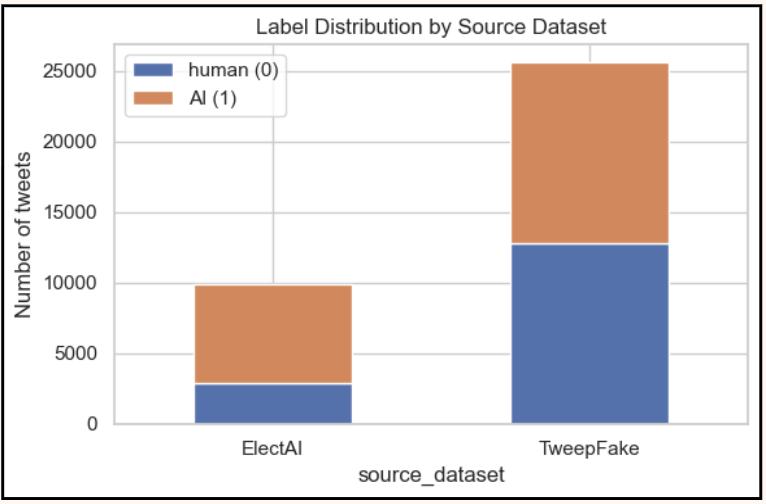
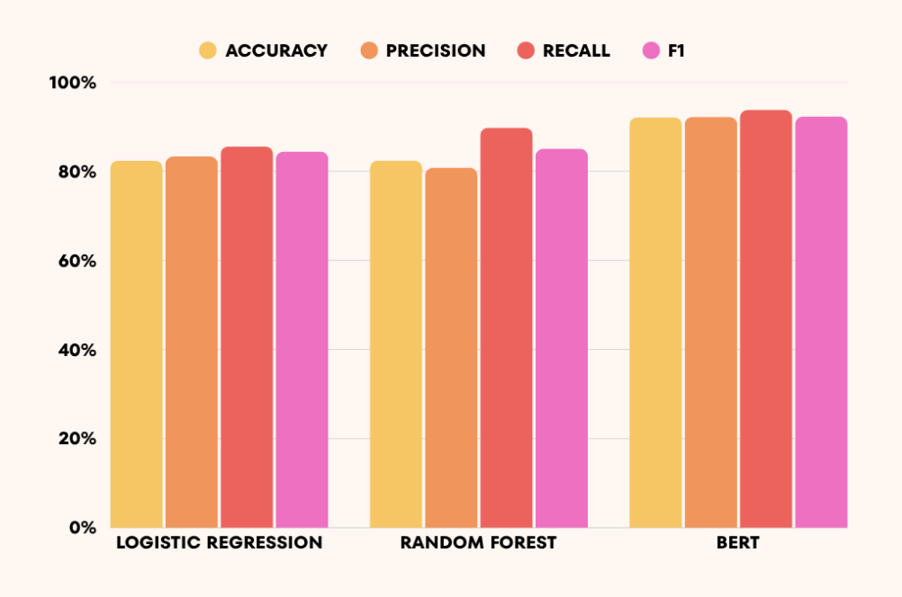
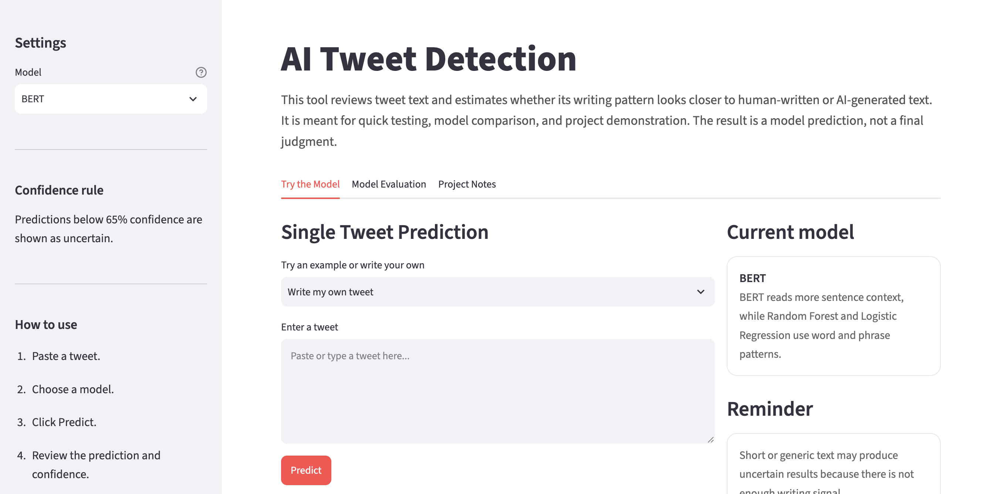

# Detecting AI-Generated Tweets
**AI4ALL — Group 22D**
Carine, Gazal, Nero, Samanvitha, Alayna

*Can we classify between human vs. AI-generated tweets?*

[View the code](#project-pipeline) · [Try the app](streamlit_app)

---

## Project Overview

An estimated 20%+ of accounts on X (formerly Twitter) are believed to be bots, and even conservative academic estimates put automated accounts at 9–15% of all users — tens of millions of accounts. As generative AI has gotten better at producing convincing, human-sounding text, it's become harder to know whether the content you're reading was written by a real person or generated by AI at scale. That matters for researchers studying discourse, journalists verifying sources, and platforms trying to maintain user trust.

**Our research question:** *How can the process of creating AI/ML solutions amplify or mitigate bias in the case our group is using?*

### How the project evolved
We didn't start here. Our original project filtered disaster-related tweets during natural disasters, but that direction lacked a clear target audience and a realistic deployment path. We pivoted to AI tweet detection — a problem with a concrete, testable question and a direct connection to a real-world use case (detecting AI-driven election content).

### The dataset
We combined two public datasets into one benchmark of **35,443 tweets** (44.2% human / 55.8% AI-generated):

| Source | Description | Rows (cleaned) |
|---|---|---|
| [TweepFake](https://journals.plos.org/plosone/article?id=10.1371/journal.pone.0251415) | General human-vs-bot tweet benchmark; bots generated via Markov chains, RNN, LSTM, and GPT-2 | 25,553 |
| [ElectAI](https://arxiv.org/abs/2404.16116) | Election-claims authorship dataset; AI tweets generated via Falcon, LLaMA, and Mistral | 9,890 |

TweepFake alone would only teach a model to catch older, simpler bots. ElectAI adds modern LLM output and grounds the task in a real civic-integrity use case. The merged dataset (`combined_ai_tweet_detection_dataset.csv`) has 0 missing values and 0 duplicate tweets after cleaning, and is the shared input for every notebook and the app.

### The algorithms
We trained and evaluated three supervised classification models on the same stratified 80/20 train-test split:

| Model | Type | Input → Output |
|---|---|---|
| **Logistic Regression** | Supervised, TF-IDF features | Tweet → TF-IDF vectorization → linear decision boundary → Human or AI. Our baseline: simple, fast, interpretable, but assumes a linear boundary and struggles with complex language patterns. |
| **Random Forest** | Supervised, TF-IDF features | Tweet → TF-IDF features → 100 decision trees → majority vote → Human or AI. Captures non-linear relationships but still depends on handcrafted TF-IDF features and ignores word order. |
| **BERT (fine-tuned)** | Supervised, transformer | Raw tweet → tokenizer → BERT transformer → classification layer → Human or AI. Understands context and word order with no manual feature engineering, at higher compute cost. |

### Model evaluation

| Model | Accuracy | Precision | Recall | F1-score | AUC-ROC |
|---|---|---|---|---|---|
| Logistic Regression | 82.35% | 83.30% | 85.55% | 0.844 | 0.919 |
| Random Forest | 82.37% | 80.79% | 89.77% | 0.850 | — |
| **BERT** | **92.09%** | **92.20%** | **93.76%** | **0.930** | — |

BERT outperformed both classical models across every metric. But breaking Random Forest's results down **by source dataset** revealed the more important finding:

| Source | Accuracy | F1 |
|---|---|---|
| ElectAI | 98.1% | 0.987 |
| TweepFake | 76.3% | 0.781 |

The model's top predictive feature was the literal string `https`, followed by election-topic words like `county` and `voter fraud`. Because ElectAI is mostly AI-labeled and entirely election-focused, the model had partly learned **"is this an election tweet"** as a proxy for **"is this AI-generated"** — a topic/label correlation introduced by how we merged the datasets, not a true writing-style signal. Our headline accuracy numbers therefore overstate how well the models detect AI *writing style* independent of topic.

---

## Visuals

**Class balance by source dataset** — TweepFake is nearly 50/50 human vs. AI; ElectAI is heavily AI-skewed (2,866 human vs. 7,024 AI), which is the root cause of the topic-leakage finding above.



**Model comparison** — Accuracy, Precision, Recall, and F1 across all three models, side by side.



**Try it yourself** — an interactive [Streamlit app]([streamlit_app](https://machine-learning-project-22d-atu8bhkcttbebpd44xntd2.streamlit.app/)) lets you paste a tweet, pick a model, and get a live prediction with confidence score, or run batch predictions on a CSV.



---

## Impact & Bias

**Positive societal impact:** a working classifier like this can help platforms detect automated/AI-driven accounts, help researchers filter AI-generated content before analysis, help journalists verify authentic public conversation, and support misinformation research.

**Negative societal impact / risks:** false positives could unfairly flag genuine human writing as AI-generated; false negatives let AI content pass as human; a model like this could be misused to unfairly judge or penalize someone based on writing style rather than actual authorship; and performance may vary across writing styles, languages, and demographics not well represented in our source data.

**How AI/ML solutions can amplify or mitigate bias — our answer:** Our project shows both directions in the same pipeline. Bias was *amplified* by a dataset choice we didn't initially recognize as biased — merging TweepFake and ElectAI created a hidden correlation between topic and label, since ElectAI is 71% AI-generated and entirely election-focused. We saw this directly in Random Forest's feature importances and in its 98%-vs-76% accuracy gap across sources — the model looked far more capable than it actually was at detecting AI *writing style*. At the same time, our process also *mitigated* bias where we caught it: `class_weight="balanced"` prevented the models from favoring the majority class, and — more importantly — running a per-source performance breakdown instead of trusting one aggregate accuracy number is what exposed the topic-leakage problem in the first place. The takeaway: bias isn't only introduced by "bad data," it's introduced by which datasets you combine and what you choose to measure — aggregate accuracy hid the problem, and disaggregated evaluation is what surfaced it.

---

## Next Steps

- Strip URLs and topic-identifying tokens (e.g. `https`, election-specific terms) before retraining, to test how much accuracy is really style-based versus topic-based.
- Test generalization by training on one source dataset and evaluating on the other, instead of only a random split across both.
- Collect more diverse, multilingual tweet data to reduce topic and language bias.
- Extend the per-source disaggregated evaluation (currently only run for Random Forest) to Logistic Regression and BERT.

---

## Project Pipeline

The repo is organized as a sequence of notebooks, each feeding the next:

1. **[`AI_Tweet_Detection_Dataset.ipynb`](AI_Tweet_Detection_Dataset.ipynb)** — Dataset selection and merge: loads TweepFake and ElectAI from their public GitHub repos, standardizes both onto one binary label (`0` = human, `1` = AI-generated), cleans the text, and saves `combined_ai_tweet_detection_dataset.csv`.
2. **[`EDA.ipynb`](EDA.ipynb)** — Exploratory data analysis: missing-value/duplicate checks, class balance, source and generator-type breakdowns, tweet length distributions, sample tweets.
3. **Modeling notebooks**, each trained/evaluated on the same merged dataset:
   - [`modeling.ipynb`](modeling.ipynb) — Logistic Regression on TF-IDF features (unigram vs. bigram comparison)
   - [`Random_Forest_AI_Tweet_Detection_Model.ipynb`](Random_Forest_AI_Tweet_Detection_Model.ipynb) — Random Forest, including the per-source performance breakdown and feature-importance analysis
   - [`BERT_model.ipynb`](BERT_model.ipynb) — fine-tuned `bert-base-uncased`
4. **[`streamlit_app/`](streamlit_app)** — interactive app for trying the models on custom text.

### Setup

```bash
python3 -m venv .venv
source .venv/bin/activate
pip install pandas numpy matplotlib seaborn scikit-learn jupyter ipykernel torch transformers
```

Run any notebook with Jupyter, or execute one end-to-end from the command line:

```bash
jupyter nbconvert --to notebook --execute --inplace <notebook>.ipynb
```

### Running the Streamlit app

```bash
cd streamlit_app
pip install -r requirements.txt
streamlit run streamlit_app.py
```

### Repo structure

```
.
├── AI_Tweet_Detection_Dataset.ipynb   # Dataset load, merge, clean
├── EDA.ipynb                          # Exploratory data analysis
├── modeling.ipynb                     # Logistic Regression baseline
├── Random_Forest_AI_Tweet_Detection_Model.ipynb
├── BERT_model.ipynb                   # Fine-tuned BERT model
├── combined_ai_tweet_detection_dataset.csv
├── streamlit_app/                     # Interactive demo app
└── old_disaster_project/              # Earlier, unrelated project (disaster tweet classification)
```

---

## Citations & Data Sources

1. Fagni, T., Falchi, F., Gambini, M., Martella, A., & Tesconi, M. (2021). TweepFake: About detecting deepfake tweets. *PLOS ONE*. [journals.plos.org/plosone/article?id=10.1371/journal.pone.0251415](https://journals.plos.org/plosone/article?id=10.1371/journal.pone.0251415) — **data source**
2. ElectAI: Human vs AI Election Claims Detection. [arxiv.org/abs/2404.16116](https://arxiv.org/abs/2404.16116) — **data source**
3. Devlin, J., Chang, M., Lee, K., & Toutanova, K. (2019). BERT: Pre-training of Deep Bidirectional Transformers for Language Understanding. NAACL. [arxiv.org/abs/1810.04805](https://arxiv.org/abs/1810.04805)
4. Varol, O., Ferrara, E., Davis, C., Menczer, F., & Flammini, A. (2017). Online Human-Bot Interactions: Detection, Estimation, and Characterization. ICWSM. [arxiv.org/abs/1703.03107](https://arxiv.org/abs/1703.03107)
5. Goldstein, J., Sastry, G., Musser, M., DiResta, R., Gentzel, M., & Sedova, K. (2023). Generative Language Models and Automated Influence Operations: Emerging Threats and Potential Mitigations. [arxiv.org/abs/2301.04246](https://arxiv.org/abs/2301.04246)

## License

MIT — see [LICENSE](LICENSE).
